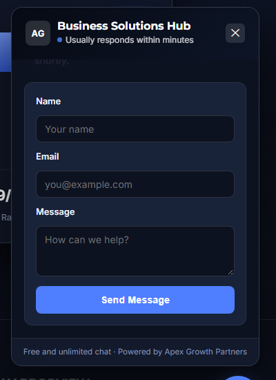
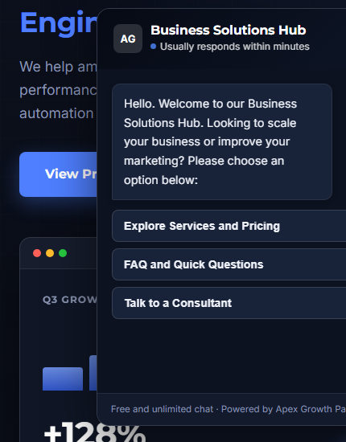

# Custom Chat Widget

[](https://github.com/LoneCod3r/Custom_Chat_Widget/actions/workflows/ci.yml)

A self-hosted chat widget — no third-party service, no volume limits, no fees. Paste 3 lines of HTML into any page and you get a floating chat bubble with a menu-driven bot and a working contact form, styled and ready to go.

---

## Demo

<table>
  <tr>
    <td align="center"><strong>Contact form (desktop)</strong></td>
    <td align="center"><strong>Chat widget (mobile)</strong></td>
  </tr>
  <tr>
    <td></td>
    <td></td>
  </tr>
</table>

> **[`/demo`](demo/index.html) is not part of the widget.** It's a sample business page showing the widget in context — screenshots above are taken from it.

---

## Step 1 — Create a free Formspree form

The widget's contact form ("Talk to a Consultant") needs somewhere to send messages. [Formspree](https://formspree.io) is a free service that emails you every submission — no backend or database required.

1. Go to **[formspree.io](https://formspree.io)** and click **Sign Up** (or **Log In** if you already have an account). You can sign up with just an email address.
2. Once logged in, click **+ New Form** on your dashboard.
3. Give it a name, e.g. `Website Contact`, and confirm the email address where you want submissions delivered (this defaults to your account email — you can change it).
4. Click **Create Form**. Formspree will show you a page with your form's endpoint URL — it looks like this:
   ```
   https://formspree.io/f/abcdwxyz
   ```
   Copy that full URL. You'll need it in Step 2.
5. **Important — confirm your first submission:** Formspree does not deliver the very first message sent to a brand-new form automatically. Instead, after you test the widget below, check the inbox you configured — Formspree will send you a one-time confirmation email with a link. Click it once, and every submission after that arrives normally.

> Free tier: 50 submissions per month, no credit card required. That's enough for most small sites — see [formspree.io/plans](https://formspree.io/plans) if you need more.

---

## Step 2 — Add the widget to your site

Open [`chat-widget.js`](chat-widget.js), copy the **entire file's contents**, and paste it right before the closing `</body>` tag of your HTML page. Then add the two lines above it:

```html
<!-- Custom Chat Widget -->
<div id="custom-chat-widget" data-formspree="https://formspree.io/f/abcdwxyz"></div>
<script src="chat-widget.js" defer></script>
```

Replace `https://formspree.io/f/abcdwxyz` with **your own** endpoint from Step 1.

That's it — no build tools, no `npm install`, no other files to include. The script creates its own styling and HTML automatically when the page loads.

**Prefer hosting the JS as a separate file instead of a 3-line embed pointing to it directly?** Copy [`chat-widget.js`](chat-widget.js) (or the smaller [`dist/chat-widget.min.js`](dist/chat-widget.min.js)) into your project folder and update the `<script src="...">` path to match. Either way, the two-line `<div>` + `<script>` snippet above is all your HTML needs.

---

## Step 3 — Test it

1. Open your page in a browser and click the blue chat bubble, bottom-right corner.
2. Click through the menu: **Explore Services and Pricing**, **FAQ and Quick Questions**, and **Talk to a Consultant**.
3. Fill out the contact form and click **Send Message**.
4. Check the inbox you set up in Step 1 — remember, the *first* submission ever sent to a new Formspree form triggers a confirmation email instead of delivering the message (see Step 1.5). Click that link once, then submit the form again to confirm real messages arrive.

If you're testing by double-clicking the HTML file directly (`file://` in your browser), some browsers restrict the network request the form needs to make. If the form seems to hang or error, serve the page through a simple local server instead:

```bash
python -m http.server 8000
```

Then open `http://localhost:8000/yourpage.html`.

---

## Customizing

Everything is plain text inside `chat-widget.js` — no build step, just edit and save.

| To change... | Look for... |
|---|---|
| Chat header title | `"Business Solutions Hub"` |
| Welcome message | The string starting `"Hello. Welcome to our Business Solutions Hub..."` inside `openChat()` |
| Menu button labels | The `opts` array inside `showMainMenu()` |
| FAQ questions/answers | The `faqs` array inside `showFAQ()` |
| Colors | The hex values at the top of `CSS_TEXT` (`#4f7fff` is the main accent color) |

---

## What's in this repo

| File | What it is |
|---|---|
| [`chat-widget.js`](chat-widget.js) | **The widget.** Full, readable source — this is what Step 2 tells you to copy. |
| [`dist/chat-widget.min.js`](dist/chat-widget.min.js) | Same widget, minified (~16 KB vs ~19 KB). Functionally identical. |
| [`chat-widget.html`](chat-widget.html) / [`chat-widget.min.html`](chat-widget.min.html) | Alternative all-in-one version (`<style>` + HTML + `<script>` in one block) for projects that don't want to host a separate `.js` file. |
| [`demo/`](demo/index.html) | A sample business page showing the widget running in context. Not part of the widget itself. |
| [`test/`](test) | Automated checks (syntax validation + headless-browser smoke test) that run on every push — see the CI badge at the top. |

---

## ☕ Support the Creator

[](#)

If this widget saved you time, a small transfer helps keep free projects like this maintained.

| 🏦 Bank Transfer |  |
|---|---|
| **IBAN** | `BG75STSA93000029979791` |

> Entirely optional — free to use, modify, and deploy without any obligation (see [LICENSE](LICENSE)). ⭐ Star the repo if it was useful!
